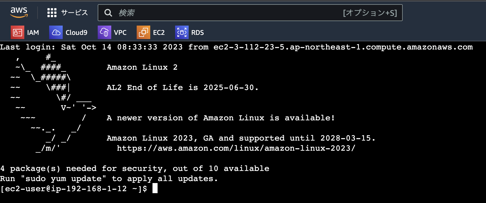
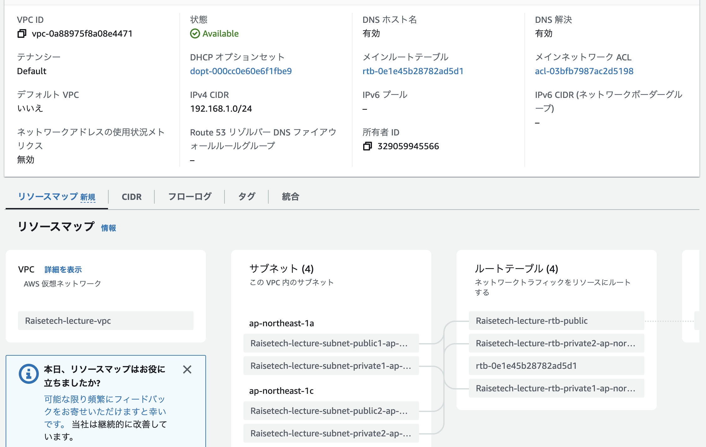
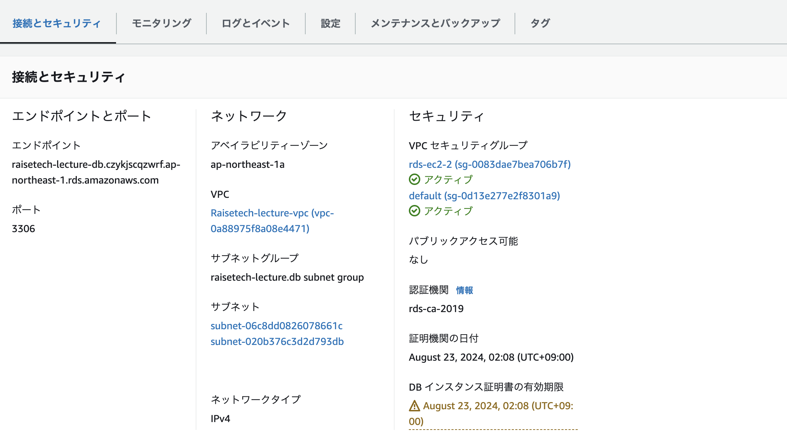
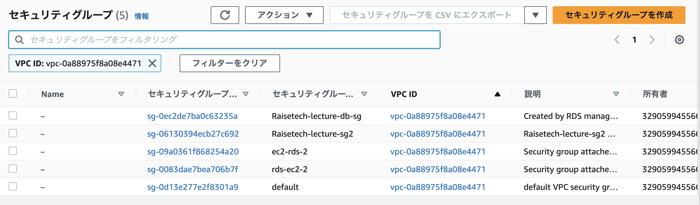

## 第４回課題報告書

#### インスタンスへの接続

#### RDSへの接続

#### VPC構成確認

#### インスタンス

#### RDS構成

#### RDSセキュリティグループ

#### セキュリティグループのルール

#### VPCセキュリティグループ

#### サブネット

#### 今回の課題から学んだこと
- VPSやセキュリティグループが正しく接続されているか確認する
- インスタンス接続は、複数方法があるが今回はブラウザ上で実施
- RDS接続は、データベース側から拒否されていればルールを見直す
- RDS接続時のパスワードはRDS起動時のパスワード
- RDS接続で、タイムアウトなどのエラーでは通信経路の問題の可能性あり
- AWS環境構築は、選択してできていくため、どこがどうつながっているのか見えにくい
- 構成を理解しようとしても用語がわからず、沼にハマっていく
- RDS作成前にサブネットグループをAZが異なるプライベートサブネット２つで作成する
- RDS作成時に上記サブネットグループを指定する（サブネット３つ以上を避ける）
- EC2インバウンドルールの22番ポートは0.0.0.0/0は避ける

#### 今回の課題での失敗と対処
##### 《不要なサービス選択してしまった》
- 対処は、削除と講師へ相談
- 削除しても更新が反映されるには１日程度かかる
- 不可抗力の免除をだめ元で問い合わせるのも手だが、できても１回限り

##### 《必要なサービスを削除してしまった》
- 上記削除中に、課題提出用のcloud9のボリュームを削除してしまった
- ボリューム再作成するも接続できなかった
- 対処は、cloud9環境作成し、githubのリポジトリをクローン